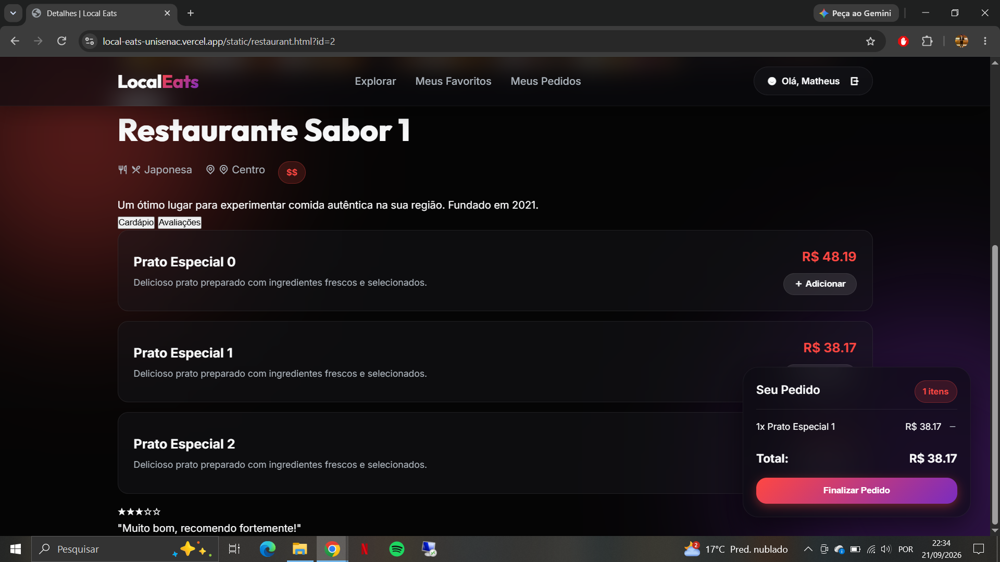
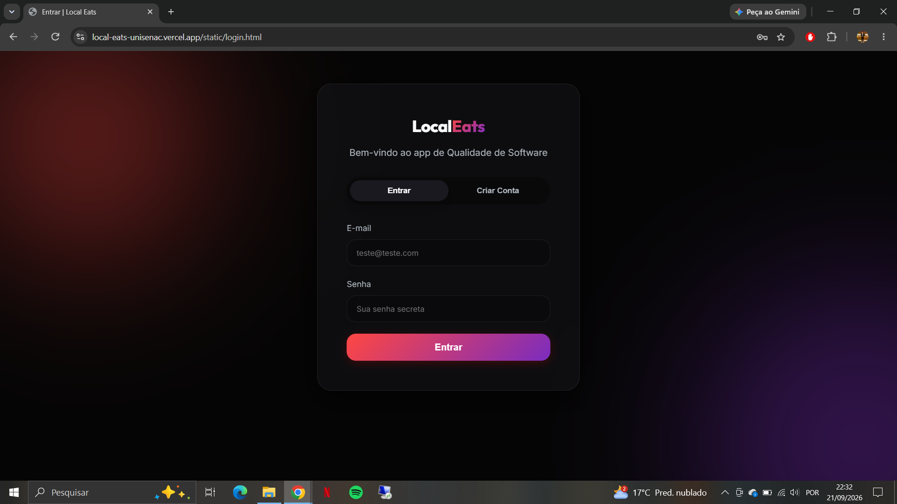
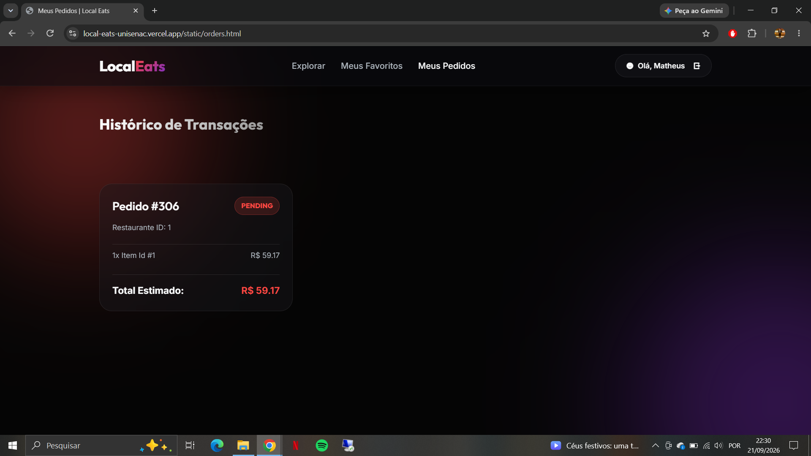
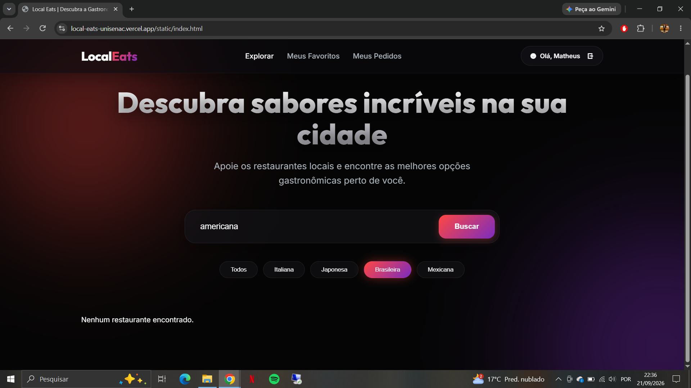
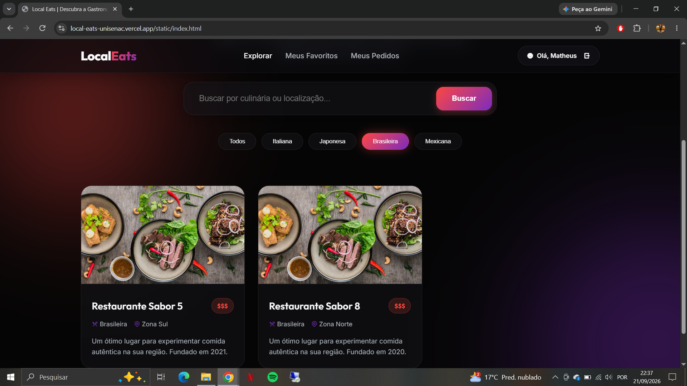

# Atividade 1 - Fundamentos e Características da Qualidade no LocalEats

**Aluno:** Matheus Gante Pinto
**Unidade Curricular:** Qualidade de Software

## 1. Fundamentos da qualidade

| Tipo | Necessidade | Interessado | Consequência se não for atendida |
|---|---|---|---|
| Explícita | Fazer pedidos pelo sistema | Usuário | O usuário não consegue realizar pedidos pelo LocalEats. |
| Explícita | Pesquisar restaurantes | Usuário | O usuário teria dificuldade para encontrar restaurantes de seu interesse. |
| Implícita | Segurança dos dados | Usuário | Dados da conta e informações dos pedidos podem ficar expostos ou vulneráveis. |
| Implícita | Facilidade de uso | Usuário | O usuário pode ter dificuldade para utilizar o sistema e realizar suas tarefas. |

### Um sistema que implementa todas as funcionalidades explicitamente solicitadas pode, ainda assim, apresentar baixa qualidade?

Sim. Mesmo que todas as funcionalidades estejam disponíveis, o sistema pode não atender necessidades implícitas dos usuários. Por exemplo, o usuário espera que seus dados estejam seguros e que o sistema seja fácil de utilizar. Se essas necessidades não forem atendidas, o sistema pode apresentar baixa qualidade mesmo funcionando.

---

## 2. Exploração da aplicação

### Funcionalidade escolhida: Fazer pedido

| Integrante | Funcionalidade | O que foi realizado | O que foi observado | Evidência |
|---|---|---|---|---|
| Matheus | Fazer pedido | Uso esperado: login, acesso a um restaurante, seleção de um prato e finalização do pedido. Uso alternativo: encerrada a sessão e realizada uma tentativa de continuar o processo sem estar autenticado. | No uso esperado, o pedido foi realizado normalmente, sem apresentar problemas durante o processo. No uso alternativo, sem estar logado, o sistema voltou para a tela de login e não deixou continuar o pedido. | `fazer-pedido-sucesso.png` e `fazer-pedido-sem-login.png` |

### Evidências

### Outras explorações realizadas

Também foram observadas outras funcionalidades:

- Não foi possível realizar um pedido sem escolher um prato.
- A consulta do pedido realizado funcionou normalmente, aparecendo no histórico de pedidos.

- Uma pesquisa sem resultado (pelo termo "americana") apresentou a mensagem "Nenhum restaurante encontrado."

- O filtro de restaurante brasileiro apresentou resultados normalmente.

---

## 3. Requisito e característica de qualidade

### Requisito de qualidade

Ao realizar um pedido, o LocalEats deve permitir que o usuário conclua o processo de forma clara, sem etapas desnecessárias ou dificuldade para entender o que deve fazer.

### Característica/subcaracterística

**Usabilidade**

### Justificativa

A funcionalidade de fazer pedido depende de o usuário conseguir entender e realizar as etapas necessárias. Por isso, a usabilidade é uma característica importante para essa funcionalidade.

### Como avaliar

A avaliação poderia ser feita observando se usuários conseguem realizar um pedido sem dificuldade, verificando se as etapas são claras e se as mensagens apresentadas pelo sistema ajudam o usuário durante o processo.

---

## Uso de inteligência artificial

**Ferramenta utilizada:** ChatGPT.

**Como foi utilizada:** Foi utilizada como apoio para organizar as ideias, estruturar o documento e revisar a descrição das atividades.

**Como as respostas foram verificadas:** As informações foram comparadas com o enunciado da atividade e com o comportamento observado diretamente no LocalEats.
